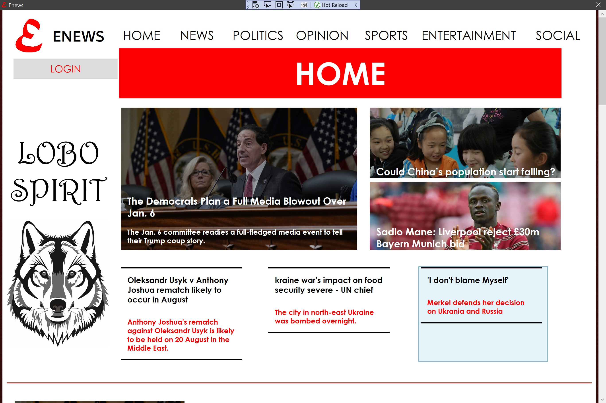
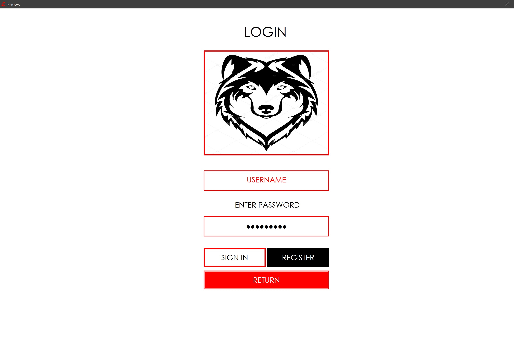
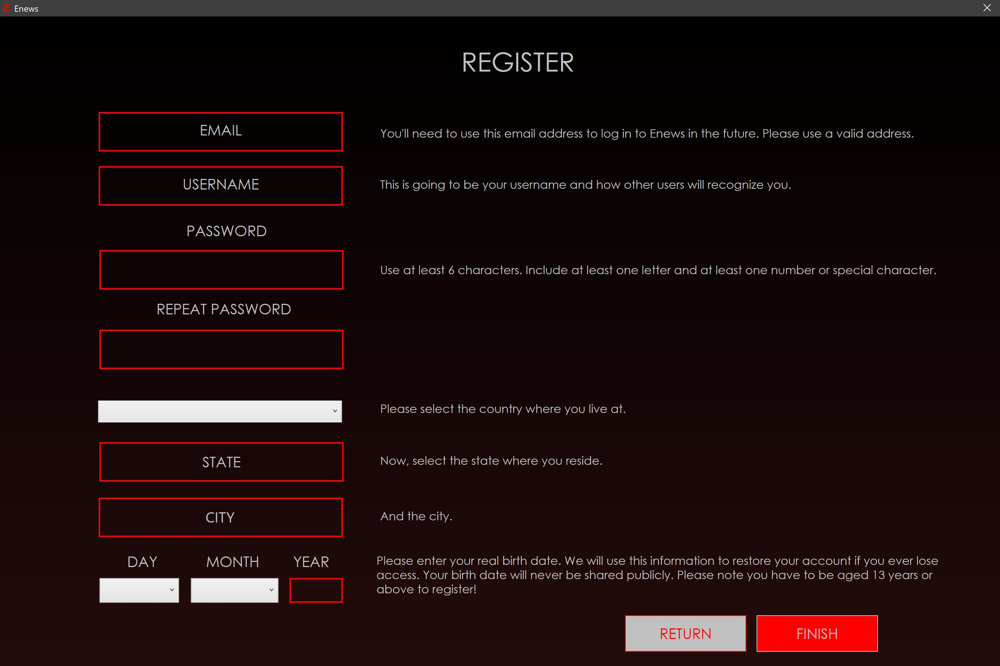
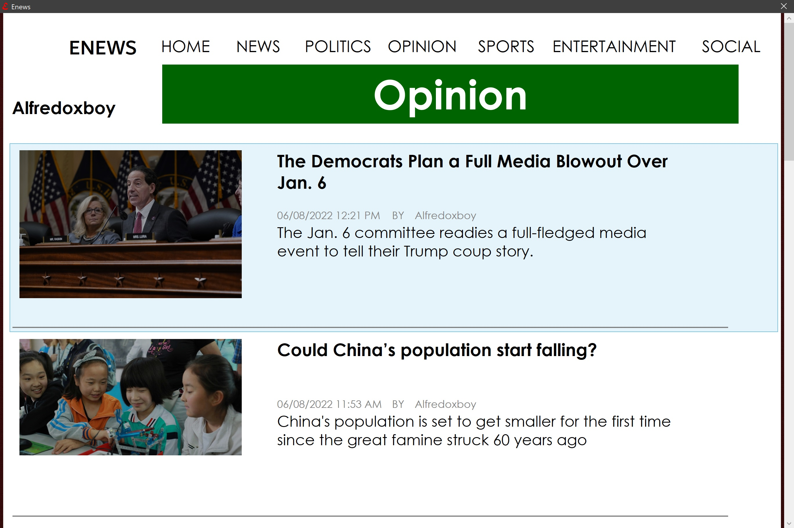
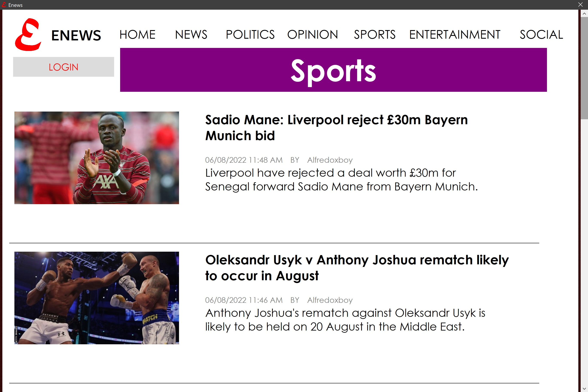
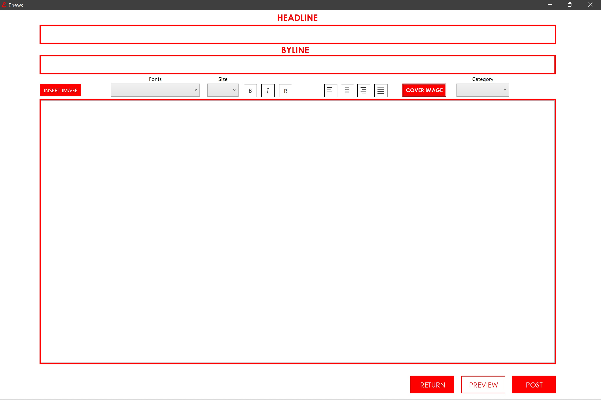
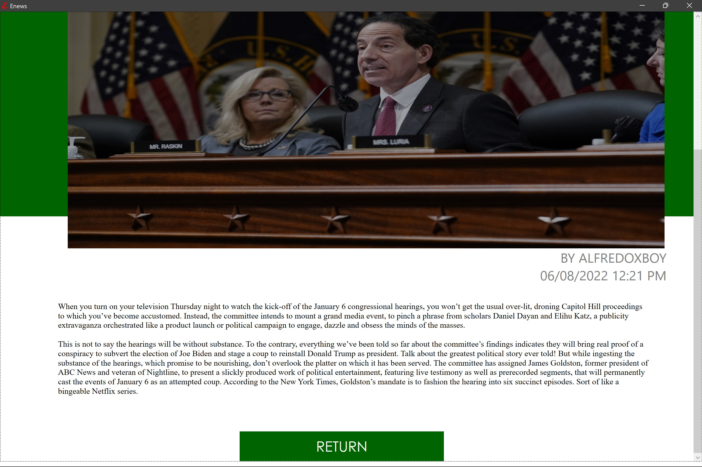

# NewsToday

NewsToday is a news platform for Windows PC created as a college project as an atempt to create a free news place where everybody can upload their own articles, reports, threads and everything within the realm of news. 

## Technologies used:

* c#
* XAML
* Example

## Features

| Free code 100% modifiable |:heavy_check_mark:|
|---------------------------|------------------|
| Login & Sign Up           |:heavy_check_mark:|
| Intuitive GUI             |:heavy_check_mark:|
| Password Security         |:heavy_check_mark:|
| News Categories           |:heavy_check_mark:|
| Previews Articles         |:heavy_check_mark:|
| Rich Text Box             |:heavy_check_mark:|
| CRUD Operations           |:heavy_check_mark:|
| Light Theme               |:heavy_check_mark:|

Main Window

------------------------------------------------

Login Screen

------------------------------------------------

User Registration

------------------------------------------------

Categories

------------------------------------------------

Creating New's Article

------------------------------------------------

Showing Article

------------------------------------------------

## About The Project

This is a college project for my senior CAPSTONE class. It is a prototype of
a news portal where users can create an account and upload their news to the
desktop application. It still has a room for improvement on the client side, and
their server side has to be set up to be able to save the information to a database.
After it has the necessary advances, the first version of the app could be launch on 
the microsoft store.

